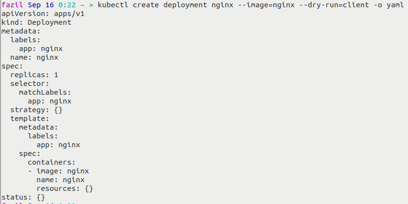

# Kubectl Commands

### Pods

#### To List running pods in node:  

##### command:  `kubectl get pods`

<left></left>

#### To Delete running pod in node:

#####  command: `kubectl delete pods [POD_NAME]`

<left></left>

------

### Deployments

#### To Create a deployment:

##### command:  `kubectl create deployment [DEPLOYEMNT_NAME] --image=[CONTAINER_IMAGE_NAME]`

<left></left>

#### To List deployments:

##### command:  `kubectl get deployments`

<left></left>

#### To Edit a deployment:

##### command:  `kubectl edit deployment [DEPLOYMENT_NAME]`

<left></left>

**Note**: When I edited the `spec->containers->image` from **nginx** to **nginx:1.16**

<left></left>

- The new container `nginx-depl-7d9b57bb64-znkn2` is being created
- Once the new container is active, old container will be deleted
- Above example is with respect to **Pods**, but the same will happen with **ReplicaSets**

#### To expose a Deployment to outside network:

##### command: `kubectl expose deployment [DEPLOYMENT_NAME] --type=NodePort --port=80`

<left></left>

###### after exposing the deployment, run `kubectl get services` to get external IP address

<left></left>

------

### Services

#### To Check running services in node:

##### command: `kubectl get services`

<left></left>

------

### ReplicaSet

#### To Check running replcaset in node:

##### command: `kubectl get replicaset`

<left></left>

------

### Useful Commands

#### To check logs of a Pod

##### command: `kubectl logs [POD_NAME]`

<left></left>

#### To get detailed info of a Pod

##### command: `kubectl describe pod [POD_NAME]`

<left></left>

#### To enter into interactivity mode(log in to the pod) of the Pod

##### command: `kubectl exec -it [POD_NAME] -- bin/bash`

above command will start the bash command of respective Pod

<left></left>

#### To generate a basic Deployment Config file

##### command: `kubectl create deployment [DEPLOYMENT_NAME] --image=[CONTAINER_IMAGE_NAME] --dry-run=client -o yaml`

- The **`--dry-run=client`** option simulates the action, without actually running it
- The **`-o yaml`** option prints the file in YAML format

<left></left>

#### To Create a Deployment using a Config file

##### command: `kubectl apply -f nginx-deployment.yaml`

<left></left>

- After creating the deployment using config file, when i update the **replicas to 2** in config file and apply the deployment again, observe in the below image. 

  - instead of **`deployment.apps/nginx created`** as shown in image above
  - it is showing **`deployment.apps/nginx configured`**
  - this is because, kubernetes is aware when to create new deployment, and when to update

- <left></left>

------

#### NOTE:

- <left></left>

  **ReplicaSet** is managing the replicas of **Pod**

  - **nginx-depl-5fcbf6fffd**  : ReplicaSet
  - **nginx-depl-5fcbf6fffd**-jwgtz : Pod

- Deployment manages a ReplicaSet  
- ReplicaSet manages Pod  
- Pod is a abstraction of a Container
- Everything below a Deployment will be managed by Kubernetes

