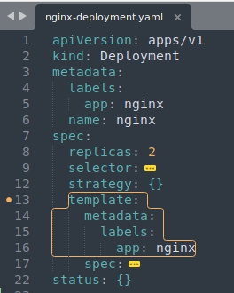

# YAML Configurations

- 3 parts of configuration files
- Connecting  Deployments to Services to Pods

------

####  3 parts of configuration files

- Metadata

  - <left></left>

- Specification

  - <left></left>

- Status(Desired/Actual, basis of self healing feature)

  - **etcd** holds the status data

**Note**: Attributes of Specification are specific to the Kind! 

------

#### Blueprint for Pods

- Template
  - this template applies to the **Pod** of Deployment, basically a blueprint for the pod
  - this decides
    - on which which port it should open
    - what will be the name of container
    - which image it should be based on

<left></left>

------

#### Connecting  Deployments to Services to Pods

- Labels, Selectors & Ports

- The connection is established through Label & Selector

  - **Metadata contains Labels**

  - **Specification contains Selector**

  - Pods gets the Label though template blueprint

    - <left></left>

  - The label is matched by selector, to indicate that the Pod belong to that Deployment

    - <left></left>

  - Deployment has it's own label, which is used by Service to connect to deployment

    - 
<left></left>  <left></left>

  - Port Setting
  
     

        

          <strong>DB Service</strong> 
          port: 80
        

        
&#8595;

        

          <strong>nginx Service</strong> 
          targetPort: 8080
        

        
&#8595;

        

          <strong>Pod</strong>
        

      

  

<left></left><left></left>

- Container runs on port 8080. Service make others access the network at port 80 on TCP protocol, and forwards the connection to port 8080 

  -   <left></left>

  -   When we describe the service, we can see that two endpoints are present(since 2 replicas were configured in deployment)

      -   Pods are running at IP:  **10.244.0.16**, **10.244.0.17**

      -   and having the Port:  **8080**

      -   <left></left>

      -   in above command, **`-o wide`** option is used to get more details of pods

  -   
