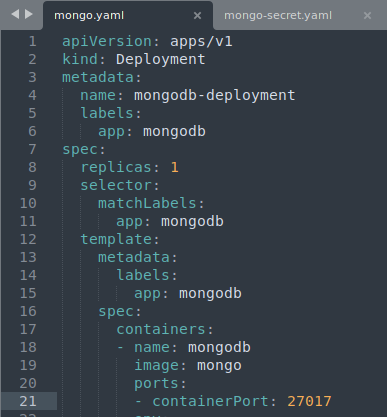

# MongoDB - Express Demo

#### Mongo Deployment

- <left></left>

  - Above deployment has these things:
    - **Label:** mongodb
    - **Replicas:** 1
    - **Image:** mongo [ https://hub.docker.com/_/mongo/ ]
    - **Selector:** mongodb
    - **ContainerPort:** 27017
  - We also need **Username** & **Password**
    - Since its sensitive data, we are creating **mongo-secret.yaml** file, where we store them
      - <left></left>
      - In this file:

        - **Kind:** Secret

        - **Name:** mongodb-secret(which will be referred in deployment file)

        - **Type:** Opaque (Default & mostly used type)

        - **Data:** Where we store the actual env variables

          - Notice that the username & password looks like its encrypted. It's just Base64 encoded form of the actual data

          - <left></left>

- Once you create a Secret Config file, you will have to apply it

  - <left></left>

  - This shows that now the Secret are in place.

- After the Secrets are stored in kubernetes, you can modify Deployment file

  - <left></left>

    
    - In this **spec**:
    
      - **name:** Any random name
    
      - **image:** container image name (will be pulled from container registry)
    
      - **ports:** the port on which the container will run
    
      - **env:** env variables, which will be forwarded to container
    - In above image, you can see that the **env** key is defined to get environment variables for the mongo container.
    - Refer **mongo** image from docker-hub, to see what should be the actual env variable name
    - **mongodb-secret** is the name of the Secret stored/applied previously
    - **mongo-root-username** & **mongo-root-password** is the data stored in the Secret

- Once secrets are imported, you can apply the deployment

  - <left></left>

  - This shows that deployment is applied

- Now you have to expose the MongoDB to Internal network

  - To do so, you can create a separate YAML file or you can include it in Deployment YAML file.

    - Yes, you can have multiple config in same file

  - <left></left>

    - In this **Service** we have:
      - **name:** Any random name
      - **selector:** will match the deployment label and connect the service to that deployment
      - **port:** the port on which the service will port forward
      - **targetPort:** the port on which the container is running
  
  - After this, just apply the deployment file
  
  - <left></left>
  
    - just the first command

------

### Mongo Express Deployment

- <left>

  - Above Deployment has these things:
    - **Label:** mongo-express
    - **Replicas:** 1
    - **Image:** mongo-express [ https://hub.docker.com/_/mongo-express/ ]
    - **Selector:** mongo-express
    - **ContainerPort:** 8081
  
  - Since **Username** & **Password** is same as previous deployment, we are re-using it
  
  - But for this deployment, we also need **Database URL**, since it'll be connecting to deployed MongoDB.
    - We will be using **ConfigMap** file for this (because we can re-use the URL for other components also, and keep it centralised)
  
    - <left></left>
  
      - Here **database_url: mongo-service**, is nothing but the **Service** created for **Mongo** Deployment
  
      - <left></left>
  
    - Once file is saved, apply the file
  
      - <left></left>
  
    - After the ConfigMap is created, add the env variable in deployment file
  
      - <left></left>
  
      - env has following:
  
        - **name:** name of the environment
        - **secretKeyRef:** this will contain two keys = **name**(name of the secret) & **key**(key which holds the value)
        - **configMapKeyRef:** this will contain two keys =**name**(name of config map) & **key**(key which holds the value)
        
      - Here, the only difference from Secret is
      
        - instead of **secretKeyRef** we use **configMapKeyRef** in env **valueFrom** field
  
  - Once the environment variables are imported. Apply the Deployment file
  
    - <left></left>
  
  - The Deployment is done, ***but we can not access*** it, since no **Service configuration** is done
  
  - Here, we have to add an **type** key inside **spec** field.
  
  - <left></left>
  
    - Above Service has these things:
      - **name:** mongo-express-service (any suitable random name)
      - **selector:** mongo-express (match the deployment label and connect the service to that deployment )
      - **type:** LoadBalancer (assigns service an external IP address and accepts external request)
      - **nodePort:** port for external IP address(port you need to put in browser)
  
    - Once you save the file, apply the Deployment/Service
  
    	- <left></left>
  
    
    - After Deploying, you can see that the **mongo-express-service** service has public/external IP which can be used to connect to the app
    
      - <left></left>
    
      - **NOTE**:
    
        - **LoadBalancer**: used for exposing network to external traffic
        - **ClusterIP**(default in Service): used for exposing network to internal traffic
        - in above image **EXTERNAL-IP** column for **mongo-express-service** is showing **`<pending>`** because of local setup, if this was a cloud setup it will show actual IP address
    
    - Since I'm using **`minikube`** for local kubernetes, i have to run below:
    
      - <left></left>
    
      - This will give a URL Link, as well as open the link in browser
    
      - <left></left>

