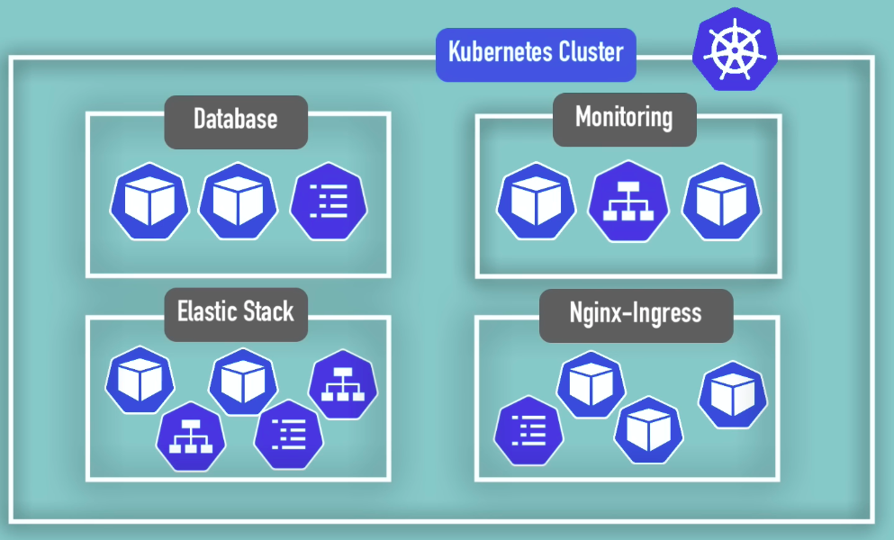
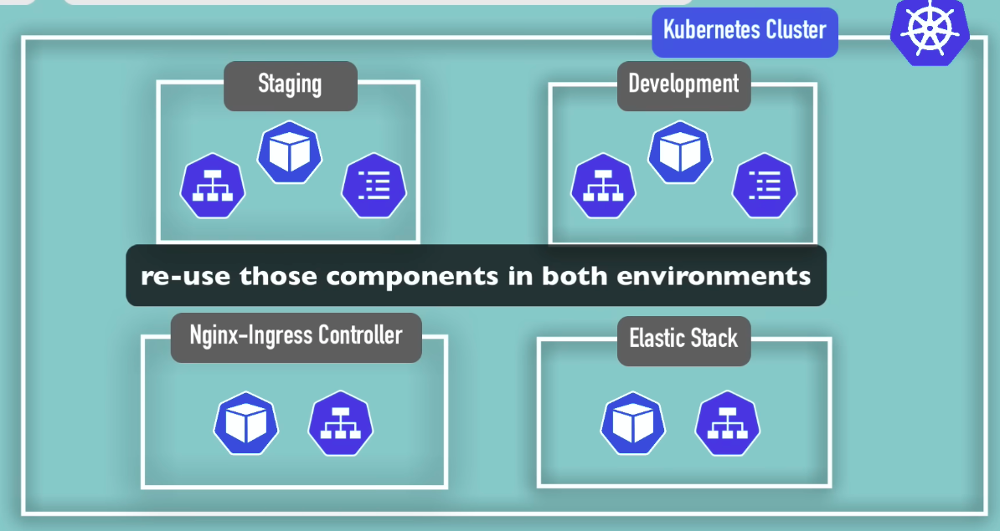

- # Namespace

Namespace can work with only Name-spaced objects, and not cluster-wide objects

#### **To list Name-spaced Objects:**

**`kubectl api-resources --namespaced=true`**

<left></left>

#### To list Cluster-wide Objects:****

**`kubectl api-resources --namespaced=false`**

<left></left>

------

#### Default Namespaces

Total of 4 default namespace is present, to display namespaces: **`kubectl get namespace`**

<left></left>

- **kube-system:** The namespace for objects created by the Kubernetes system.
- **kube-public:** This namespace is readable by *all* clients (including those not  authenticated). This namespace is mostly reserved for cluster usage, in  case that some resources should be visible and readable publicly  throughout the whole cluster.
- **kube-node-lease:** Node leases allow the kubelet to send heartbeats so that the control plane can detect node failure.
- **default:** Kubernetes includes this namespace so that you can start using your new cluster without first creating a namespace.

---

#### Creating Namespaces

- using **kubectl** command
  - **`kubectl create namespace [NAMESPACE_NAME]`**

  - <left></left>

- using **config file**

  - <left></left>

  - <left></left>

---

#### Why Use Namespaces

- Without it

  - No Logical Grouping

    - Hard to manage resources, no overview

    - Everything in one Namespace

    - <left></left>

  - Conflicts: Many teams, same application

    - If a different team applies a config with same name, the first teams config will get overridden, which is an conflict 

    - <left></left>

- With it

  - Logical Grouping

    - Resources grouped in Namespaces

    - <left></left>

  - No Conflict

    - Since both the team is using different namespace, there wont be conflict

    - <left></left>

  - Resource Sharing

    - Can use a single deployed component for both application

    - <left></left>

  - Access and Resource Limits on Resource

    - Minimise risk of one team mistakenly interfering with other teams

    - <left></left>

---

#### Characteristics of Namespaces

- You cant access most resources from another namespaces

  - <left></left>

- You can access Service in another Namespace

  - <left></left>

- 
